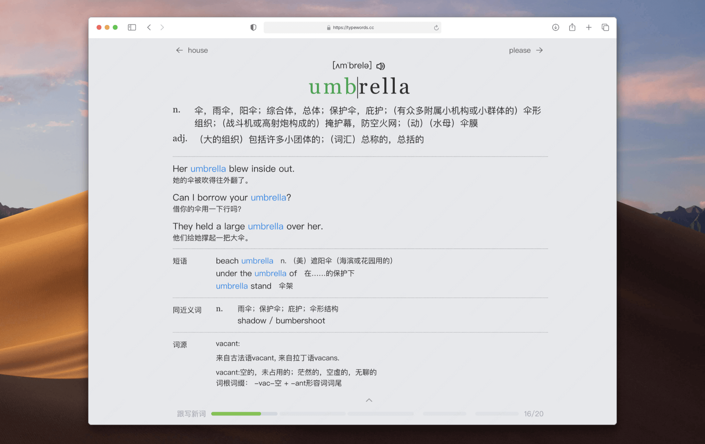

<div align="center">

# ⌨️ FluType

### 打字学英语，开口就流利

结合 FSRS 记忆算法 + 真人录音 + 打字肌肉记忆，让每一次按键都成为学习的一部分。

</div>

---

## 🌐 在线体验

**https://zswlht.github.io/FluType/**

<div align="center">
  
</div>

## ✨ 功能特色

### 🔤 单词练习
- 50+ 词典，FSRS 智能复习算法，打字即记忆
- 多种练习模式：跟打 / 默写 / 自测 / 听写
- 提供音标、发音（美音/英音）、例句、短语、同义词、词根、词源等

### 📖 文章练习
- 内置新概念英语等经典教材，真人录音
- 跟打 + 默写双模式，逐句输入、自动发音
- 一键翻译、双语对照，边听边写强化记忆

### 💬 句子练习
- 从文章提取的句子集，专注单句听说训练
- 支持自动跳过符号/数字/人名，专注核心内容

### 🎯 其他特色
- **FSRS 记忆算法**：科学间隔重复，记得牢不遗忘
- **打字即记忆**：边打边记，肌肉记忆加深印象
- **真人发音**：原文录音 + 词典发音双重支持
- **离线可用**：数据本地保存，无需联网也能学
- **完全免费**：开源项目，无广告无内购

## 🛠️ 技术栈

- **框架**：Nuxt 3 + Vue 3 + TypeScript
- **构建**：Vite + pnpm workspace（monorepo）
- **状态管理**：Pinia + Reactivity Transform
- **记忆算法**：FSRS（Free Spaced Repetition Scheduler）
- **部署**：GitHub Pages（静态生成）

## 🚀 本地开发

```bash
# 安装依赖
pnpm install

# 启动开发服务器
pnpm --filter @typewords/nuxt dev

# 构建静态站点
pnpm --filter @typewords/nuxt exec nuxt generate
```

## 📁 项目结构

```
FluType/
├── apps/
│   └── nuxt/              # Nuxt 3 主应用
├── packages/
│   ├── core/              # 核心业务逻辑、组件
│   ├── base/              # 基础 UI 组件库
│   ├── libs/              # 第三方库封装
│   └── utils/             # 工具函数
└── package.json
```

## 📄 License

MIT
